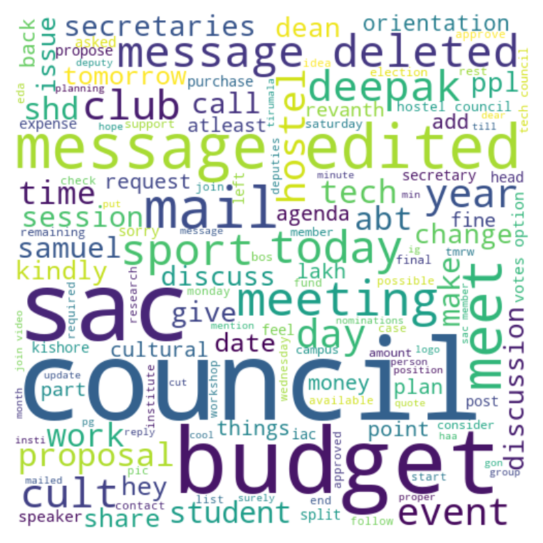
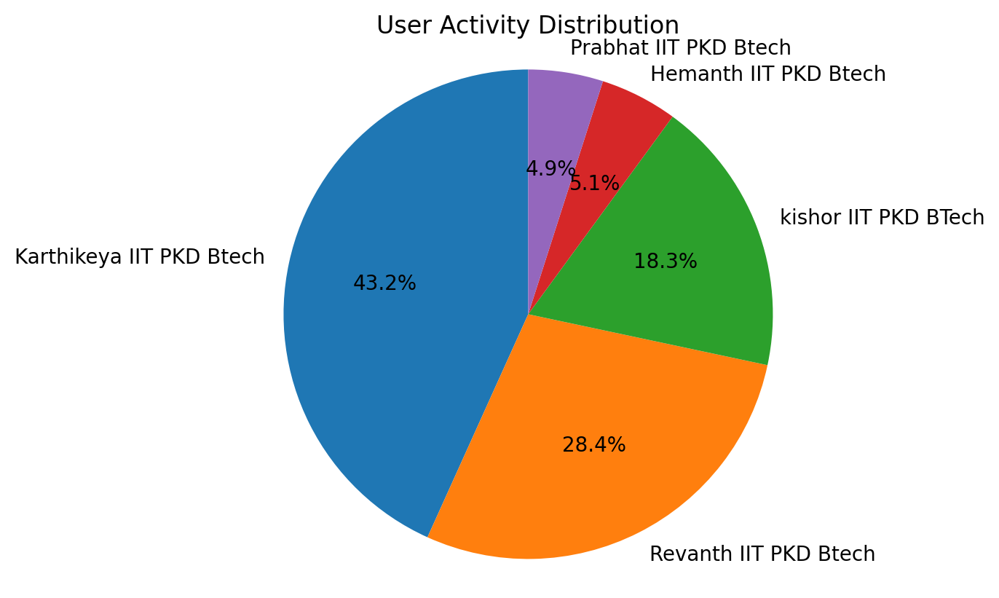

# Social Media Chat Analyzer

## Overview

The **Social Media Chat Analyzer** is a Python-based application designed to analyze chat data from various social media platforms. This tool provides insights into communication patterns, sentiment analysis, and user engagement metrics, making it ideal for researchers, businesses, and individuals looking to better understand social media interactions.

### Current Support
- WhatsApp Group Chat

## Features

- **Data Extraction**: Import chat data from WhatsApp.
- **Message Analysis**: Analyze user messages for sentiment, frequency, and response times.
- **Visualization**: Generate visual representations of chat data, including charts and graphs.
- **User Engagement Metrics**: Track metrics such as active users, most engaged participants, and overall interaction trends.

## Key Findings for WhatsApp Group Chat
- **Total Messages**
- **Total Words**
- **Media Messages**
- **Links Shared**
- **Most Active Users**
- **Word Cloud Visualization**: Generated word cloud image showing frequently used words.
- **Common Words**: Top 20 most common words used in the chat.
- **Emoji Usage**: Breakdown of the most commonly used emojis.
- **Monthly Timeline**: Timeline showing message activity over months.
- **Daily Timeline**: Breakdown of messages by day.
- **Weekly Activity**: Analysis of activity across different days of the week.
- **Monthly Activity**: Representation of message counts per month.
- **Activity Heatmap**: Visualization of activity based on time of day and day of the week.

### Future Work
- Support for Instagram Group Chat
- Support for Telegram Group Chat


## Requirements

Install required packages listed in `requirements.txt`

## Installation

1. Clone the repository:

   ```bash
   git clone https://github.com/username/Social-Media-Chat-Analyzer.git

### Interface

)
*This is the user interface of the Social Media Chat Analyzer, where users can upload their chat data.*

### Word Cloud

)
*The word cloud visualization highlights the most frequently used words in the chat.*

### Analysis Results

)
*Here are some sample analysis results, showcasing user engagement metrics and interaction patterns.*


